# Busy Airports: Predicting TSA Traffic at Major U.S. Airports


**Team members**: [David Friedenberg](https://github.com/friedenberg12), [Agniva Dasgupta](https://github.com/adg1016), [Charuhas Shiveshwarkar](https://github.com/SChars), [Ivan Caro Terrazas](https://github.com/icaromx), [Ahmad Shamloumehr](https://github.com/)

---
# Table of Contents
1. [Introduction](#Introduction)
2. [Dataset Generation](#Dataset-Generation)
3. [Exploratory Data Analysis](#Exploratory-Data-Analysis)
4. [Modeling Approach](#Modeling-Approach)
5. [Results](#Results)
6. [Future Work](#Future-Work)
7. [Description of Repository](#Description-of-Repository)
8. [Repository Structure](#Repository-Structure)
9. [How To Run The Project](#How-To-Run-The-Project)

---
## Introduction
Airports in the United States serve as critical transportation hubs. handling hundreds of millions of travelers each year. One of the most significant bottlenecks in air travel is the TSA security checkpoint. For TSA directors, accurately forecasting passenger volume is essential for effective staffing and resource allocation. Reliable predictions of daily throughput can also help travelers anticipate longer-than-usual wait times and plan accordingly.

**Objective**: The goal of this project is to develop a predictive model for passenger throughput at TSA security checkpoints. We will begin by building and validating the model for a single airport to establish feasibility and performance. The model will forecast total passenger volume over selected future timescales (e.g. daily, weekly totals) with the flexibility to evaluate which forecasting window (days, weeks, or potentially months) yields the most reliable results. Once the single-airport model performs well, we can extend the framework to multiple US airports to test the robustness of the modeling methods.

**Stakeholders**: TSA, Airport operators/managers who make quarterly funding decisions... (to be filled in later)

---
## Dataset Generation
Dataset Source: [TSA Hourly Passenger Throughput](https://catalog.data.gov/dataset/tsa-foia-reading-room-weekly-passenger-throughput-data)

The data for this project comes from the publically available dataset listed above. This data is separated into PDF files containing data for each individual week over the past 4 years. In order to use this data, all of these PDF files need to be downloaded and processed into tabulated CSV data. For the years of data which we use in our analysis (2022-2025), this requires processing about 200 PDF files, each with about 1000 pages of tabulated data.

The scripts for reading the PDF files, identifying tabulated data, processing these tables into CSV files, and cleaning up the resulting data are provided in the `scripts/` directory. Note that the original PDF files are not included in this repository due to storage limitations. These can be found at the public webpage above.

---
## Exploratory Data Analysis

Our exploratory data analysis involved visualizing TSA Throughput data specifically at Chicago O'Hare International Airport, which was chosen to be the focus of our modelling approach. We started by plotting the total hourly, daily, and monthly throughput data.

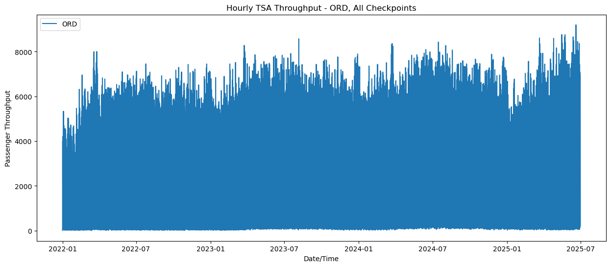
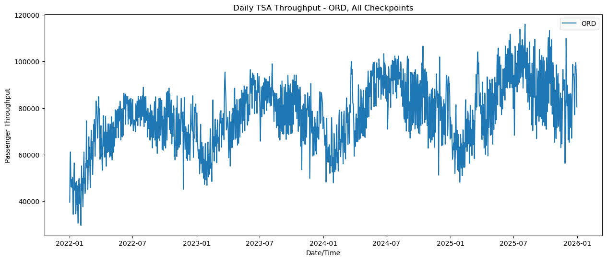
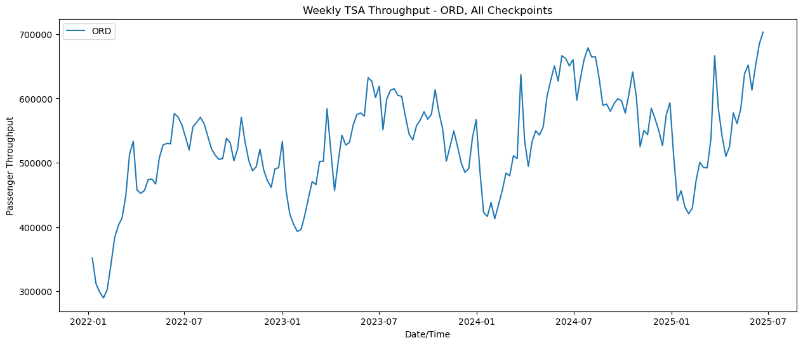

The hourly data seems far too noisy to make meaningful predictions and also involves timeframes too small for long-term forecasting. This convinced us to focus only on modeling the daily and weekly data.

We can also look at the data across multiple airports.

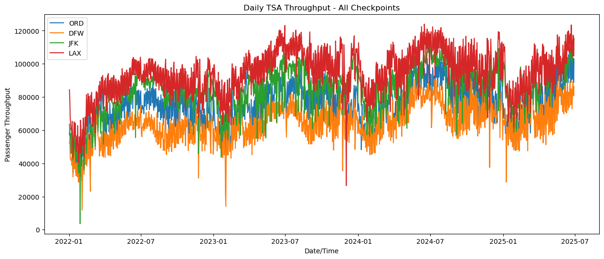
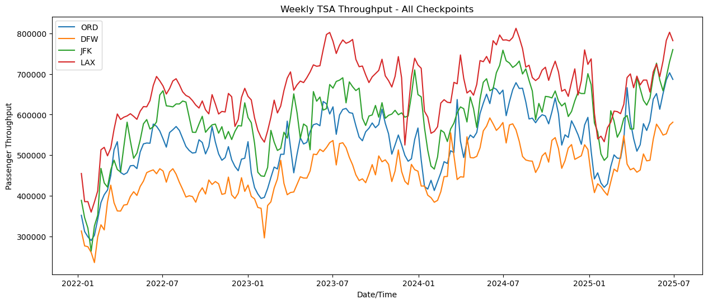

Clearly the different airports carry very similar trends. This means a model that works well on one airport may also work well on other airports.

Next we looked at the autocorrelation and partial autocorrelation functions for the daily TSA throughput data.

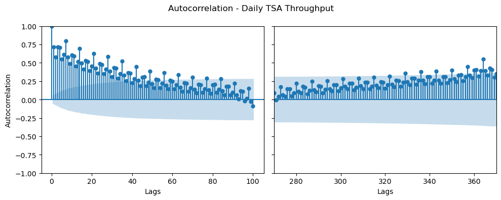
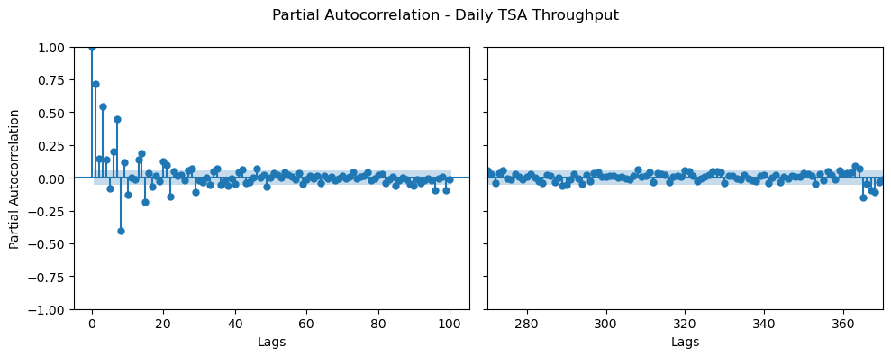

Here note from the autocorrelation that there is a large spike at every 7 lags and another large spike after 365 lags. This indicates both a weekly and annual seasonality in the daily data.

We can also look at the ACF and PACF for the weekly data.

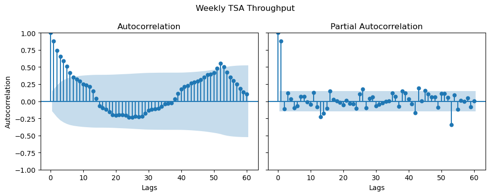

Here we observe that the dominant lags are the small lags (below about 5-6) and again there is annual seasonality indicated by a spike at lag 52.

Even though these models are clearly note stationary, we can model the seasonailty using either STL decomposition or SARIMA model, leaving the remaining residuals to be approximately stationary.

### Baseline Models

For our baseline models, we chose to use the Naive Seasonal Model with Drift and the Triple Exponential Smoothing model. These are simple enough models that are able to capture the annual seasonality and overall trend that we see in the passenger data.

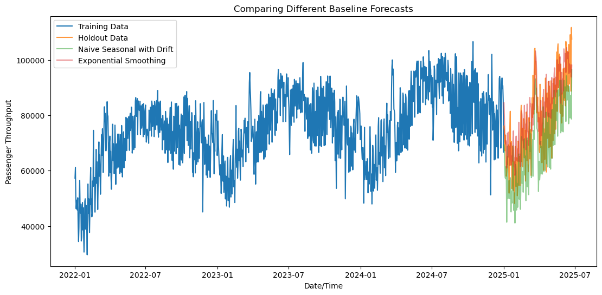
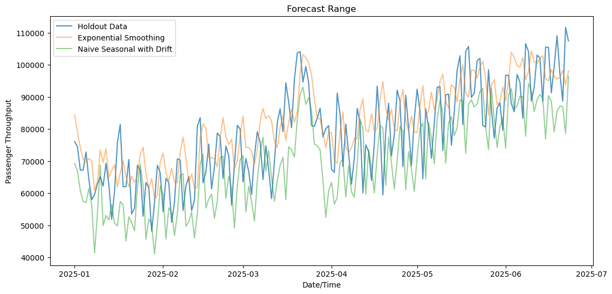
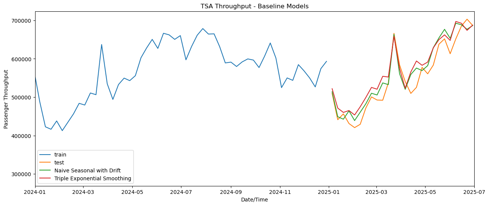

Clearly with the weekly data the baseline models do a much better job of matching the trend. These are the models that we aimed to beat with our own approaches.

---
## Modeling Approach

To improve over the baseline models we consider the following two models and train them independently for the daily and weekly day :

1. Harmonic regression + (S)ARIMA : We model yearly seasonality with a fourier modes of annual frequency and its harmonics as exogenenous variables while jointly fitting an ARIMA model (possibly with weekly seasonality for the daily data) to capture residual autocorrelation.

2. Seasonal-Trend decomposition + (S)ARIMA : We decompose the time series into seasonal, trend, and residual components using STL (Seasonal-Trend decomposition using LOESS). Following standard practice, we forecast the seasonally adjusted series (trend + residual) with an ARIMA model (with weekly seasonal order for daily data) and independently forecast the seasonal component using a naïve seasonal baseline.


For both models we obtain (S)ARIMA hyperparameters by minimising the Akaike Information Criterion (AIC) using `pmdarima.auto_arima`. For the harmonic regression model, we select the number of Fourier harmonics K by fitting OLS harmonic regression on two years of data, and validating against the subsequent one year of data, and choosing K that minimises RMSE. We compare the performance of both models by evaluating their respective MAPEs averaged over 6 expanding-window cross-validation splits of the training series, each with a test fold equal to the forecasting horizon (90 days / 13 weeks). In this way we determine which model has better predictive power in comparison to the other.

Finally we quote the performance of both our models on our test data : the last two quarters of 2025. For each quarter in the test period, we train our models on all that data up to (but excluding) the first day of the quarter and obtain forecasts and confidence intervals for the quarters ahead. 
---
## Results

---
## Future Work

---
## Description of Repository

---
## Repository Structure

```
spring-2026-busy-airports/
├── data
│   ├── tsa-throughput-data-2023-complete.csv
│   └── tsa-throughput-data-complete.csv
├── images/
├── notebooks
│   ├── Baseline Forecasts.ipynb
│   ├── eda.ipynb
│   ├── harmonic_regression_weekly.ipynb
│   ├── model_evaluation.ipynb
│   ├── stl_arima_cv_splits.png
│   ├── STL_forecasts.ipynb
│   └── STL_weekly_daily.ipynb
├── project checkpoints
│   ├── evaluation_plan.md
│   ├── kpis.md
│   └── problem_definition.md
├── scripts
│   ├── cleanup_csv_data.py
│   └── extract_pdf_data.py
├── src
│   └── busy_airports
│       ├── __init__.py
│       ├── baselines.py
│       ├── data_splits.py
│       ├── eda.py
│       ├── metrics.py
│       ├── models.py
│       └── preprocessing.py
├── busy_airports.ipynb
├── environment.yml
├── harmonic_model.ipynb
├── LICENSE
├── pyproject.toml
└── README.md
```

---

## How To Run The Project

1. **Clone the repository**

```bash
git clone https://github.com/Erdos-Projects/spring-2026-busy-airports.git
cd spring-2026-busy-airports
```

2. **Install the required dependencies**

Using Anaconda
```bash
conda env create -f environment.yml
conda activate busy_airports
```
3. **Install custom libraries (`src/busy_airports`)**

Running on the `busy_airports` environment, run:
```bash
pip install -e .
```

4. **Open the notebook and run the cells sequentially**

Open the file `busy_airports.ipynb` and execute the cells from top to bottom.

---
